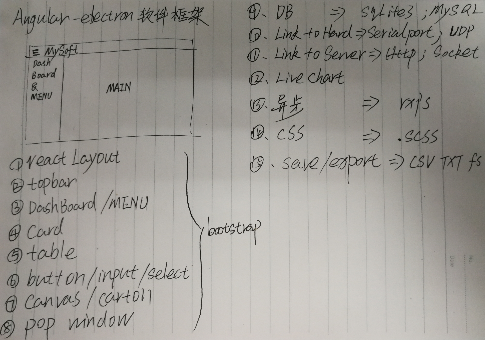

# 1. LAYOUT
* CONTAINER:  
    A responsive, fixed-width container (meaning its max-width changes at each breakpoint).  
    ```HTML
    <div class="container">
    <!-- Content here -->
    </div>
    ```
    A fluid-width (meaning it’s 100% wide all the time).
    ```HTML
    <div class="container-fluid">
    ...
    </div>
    ```
* Z-index:    
    A particular element to the forefront with a higher z-index value to show their border over the sibling elements.    
* Grid system:  
    Bootstrap’s grid system uses a series of `containers`, `rows`, and `columns` to layout and align content.   
      